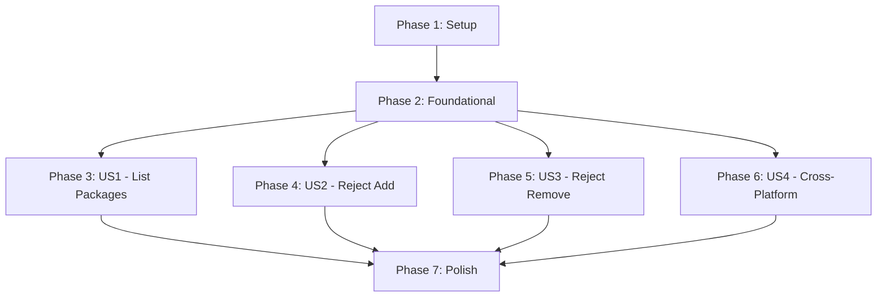

# Implementation Tasks: Solution File Support for gonuget CLI

**Feature**: Solution File Support
**Priority**: P1-P3
**Total Tasks**: 42
**Parallel Opportunities**: 21 tasks marked with [P]

## Phase 1: Setup (3 tasks)

Set up the project structure and directories for solution file support.

### Tasks

- [X] T001 Create solution package directory structure at cmd/gonuget/solution/
- [X] T002 [P] Create test directory structure at tests/cmd/gonuget/solution/ with testdata/
- [X] T003 [P] Create sample test solution files in tests/cmd/gonuget/solution/testdata/ (.sln, .slnx, .slnf examples)

## Phase 2: Foundational (5 tasks)

Core types and interfaces that all parsers depend on.

### Tasks

- [X] T004 Implement solution types in cmd/gonuget/solution/types.go (Solution, Project, SolutionFolder, ProjectType)
- [X] T005 Implement solution file detector in cmd/gonuget/solution/detector.go
- [X] T006 Implement path resolver in cmd/gonuget/solution/path.go with cross-platform support
- [X] T007 Define parser interface in cmd/gonuget/solution/parser.go
- [X] T008 Add error message constants to cmd/gonuget/commands/errors.go matching dotnet CLI

## Phase 3: User Story 1 - List Packages from Solution Files (13 tasks)

**Goal**: Enable listing packages from all projects in a solution file
**Priority**: P1
**Test Criteria**: Running `gonuget package list MySolution.sln` displays all packages with exact dotnet CLI formatting

### Tasks

- [X] T009 [US1] Create unit tests for .sln parser in tests/cmd/gonuget/solution/sln_parser_test.go
- [X] T010 [US1] Implement .sln parser (text-based) in cmd/gonuget/solution/sln_parser.go
- [X] T011 [P] [US1] Create unit tests for .slnx parser in tests/cmd/gonuget/solution/slnx_parser_test.go
- [X] T012 [P] [US1] Implement .slnx parser (XML-based) in cmd/gonuget/solution/slnx_parser.go
- [X] T013 [P] [US1] Create unit tests for .slnf parser in tests/cmd/gonuget/solution/slnf_parser_test.go
- [X] T014 [P] [US1] Implement .slnf parser (JSON filter) in cmd/gonuget/solution/slnf_parser.go
- [X] T015 [US1] Implement parser factory in cmd/gonuget/solution/parser.go GetParser() function
- [X] T016 [US1] Create integration tests for package list with solution files in tests/cmd/gonuget/commands/package_list_solution_test.go
- [X] T017 [US1] Modify cmd/gonuget/commands/package_list.go to detect and handle solution files
- [X] T018 [US1] Implement multi-project iteration logic in cmd/gonuget/commands/package_list.go
- [X] T019 [US1] Update cmd/gonuget/output/package_list.go to format multi-project output
- [X] T020 [US1] Add solution folder filtering (exclude GUID {2150E333-8FDC-42A3-9474-1A3956D46DE8})
- [X] T021 [US1] Implement silent skip for missing project files in list operation

## Phase 4: User Story 2 - Reject Solution Files for Package Add (5 tasks)

**Goal**: Return correct error when attempting to add packages to solution files
**Priority**: P2
**Test Criteria**: Running `gonuget package add MySolution.sln Newtonsoft.Json` returns exact dotnet CLI error

### Tasks

- [X] T022 [US2] Create tests for solution file rejection in tests/cmd/gonuget/commands/package_add_solution_test.go
- [X] T023 [US2] Add solution file detection in cmd/gonuget/commands/package_add.go
- [X] T024 [US2] Implement SolutionNotSupportedError type in cmd/gonuget/commands/errors.go
- [X] T025 [US2] Return proper error "Couldn't find a project to run..." for solution files
- [X] T026 [US2] Verify error message format matches dotnet CLI exactly

## Phase 5: User Story 3 - Reject Solution Files for Package Remove (5 tasks)

**Goal**: Return correct error when attempting to remove packages from solution files
**Priority**: P2
**Test Criteria**: Running `gonuget package remove MySolution.sln Moq` returns exact dotnet CLI error

### Tasks

- [X] T027 [US3] Create tests for solution file rejection in tests/cmd/gonuget/commands/package_remove_solution_test.go
- [X] T028 [US3] Add solution file detection in cmd/gonuget/commands/package_remove.go
- [X] T029 [US3] Implement InvalidProjectFileError type in cmd/gonuget/commands/errors.go
- [X] T030 [US3] Return proper error "Missing or invalid project file..." for solution files
- [X] T031 [US3] Verify error message format matches dotnet CLI exactly

## Phase 6: User Story 4 - Cross-Platform Path Handling (6 tasks)

**Goal**: Ensure solution files work correctly across Windows/Linux/Mac
**Priority**: P3
**Test Criteria**: Windows-created solution files work on Unix and vice versa

### Tasks

- [X] T032 [P] [US4] Create cross-platform path tests in tests/cmd/gonuget/solution/path_test.go
- [X] T033 [US4] Implement Windows backslash to Unix forward slash conversion
- [X] T034 [US4] Handle relative path resolution (../../shared/common.csproj)
- [X] T035 [US4] Support UNC paths on Windows (\\server\share\project.csproj)
- [X] T036 [US4] Normalize duplicate separators (path//with//double)
- [X] T037 [US4] Test with mixed-platform solution files

## Phase 7: Polish & Integration (5 tasks)

Final integration testing and performance validation.

### Tasks

- [ ] T038 [P] Create end-to-end tests comparing gonuget output with dotnet CLI output byte-for-byte
- [ ] T039 [P] Performance test with 100+ project solution (must complete in < 30 seconds)
- [ ] T040 [P] Test UTF-8 with BOM and without BOM support
- [ ] T041 [P] Add warning output formatting (yellow "Warning:" prefix to stderr)
- [ ] T042 Document solution file support in README.md and CLI help text

## Dependency Graph



## Parallel Execution Strategy

### Phase 1 (Setup)
```bash
# Can run in parallel:
T002 & T003
```

### Phase 3 (US1)
```bash
# Can run in parallel after T009-T010:
T011 & T012 & T013 & T014
```

### Phase 6 (US4)
```bash
# Can run in parallel:
T032  # Tests can be written independently
```

### Phase 7 (Polish)
```bash
# Can run all in parallel:
T038 & T039 & T040 & T041
```

## Implementation Strategy

### MVP Scope (Phases 1-3)
Implement core solution file parsing and package list functionality first. This provides immediate value to users who need to see packages across multiple projects.

### Incremental Delivery
1. **First**: Phase 1-2 (Setup & Foundation) - Basic infrastructure
2. **Second**: Phase 3 (US1) - Core functionality for listing packages
3. **Third**: Phase 4-5 (US2-3) - Error handling for invalid operations
4. **Fourth**: Phase 6 (US4) - Cross-platform improvements
5. **Final**: Phase 7 - Polish and performance validation

### Testing Approach
- Write tests first for each parser (TDD approach)
- Use actual dotnet CLI output as test oracles
- Test each solution format independently
- Validate error messages character-for-character

## Summary

- **Total Tasks**: 42
- **Setup Tasks**: 3
- **Foundational Tasks**: 5
- **User Story 1 Tasks**: 13
- **User Story 2 Tasks**: 5
- **User Story 3 Tasks**: 5
- **User Story 4 Tasks**: 6
- **Polish Tasks**: 5
- **Parallelizable Tasks**: 21 (50% can run in parallel)
- **MVP Scope**: Phases 1-3 (21 tasks)